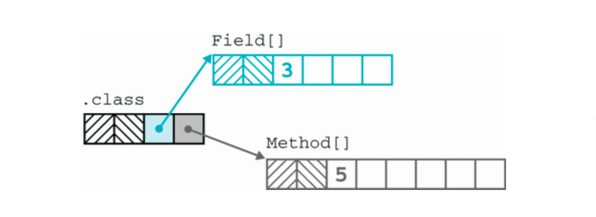

Reflection is api of Java that we can access class object of a class at run time

#### Useful way to get class object
```text
final Class<?> stringUtils = Class.forName("org.apache.commons.lang3.StringUtils");
```
`*` Class object is stored in heap like other Java objects.