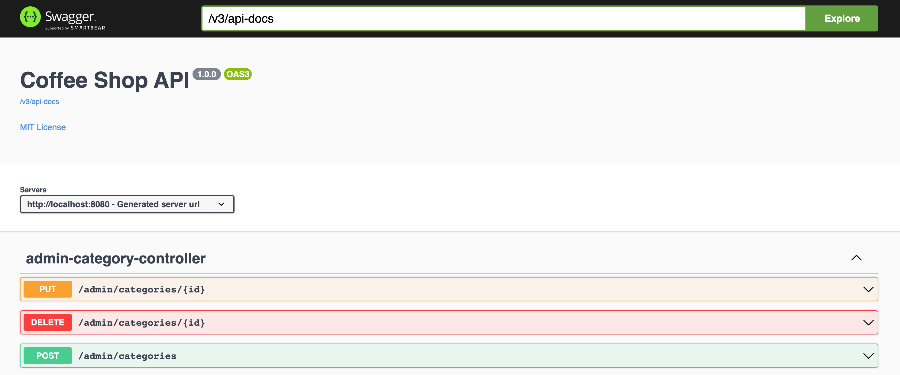

### Springdoc swagger
#### Config
_Library_
```groovy
  implementation 'org.springdoc:springdoc-openapi-ui:1.7.0' //v1
```
_Add OpenAPI bean_
```java
  @Bean
  public OpenAPI customOpenAPI() {
    return new OpenAPI()
        .components(new Components())
        .info(new Info().title("Coffee Shop API").version("1.0.0")
        .license(new License().name("MIT License").url("https://github.com/thachlp/second-brain/blob/main/LICENSE")));
    }
```

_Optional config_
```yaml
springdoc:
  default-produces-media-type: application/json
```

#### Result
